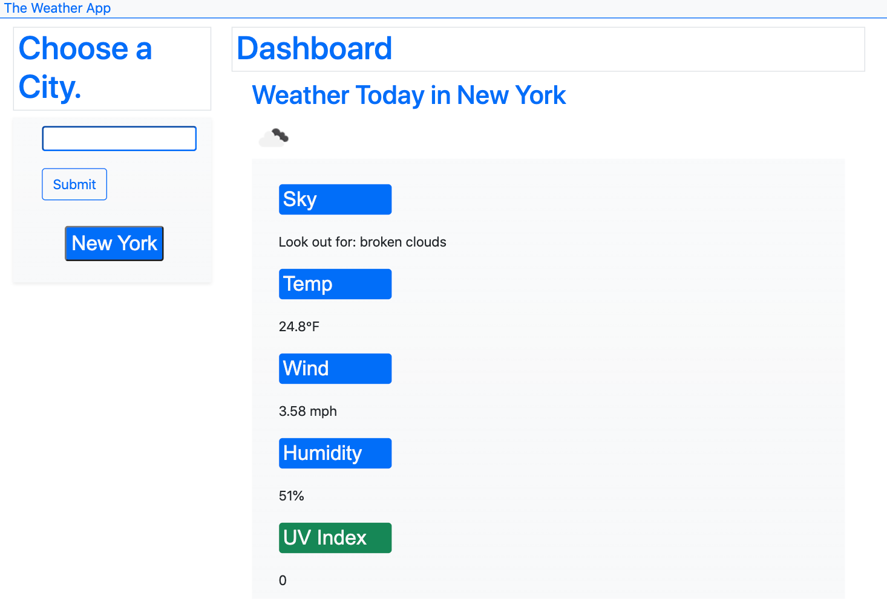
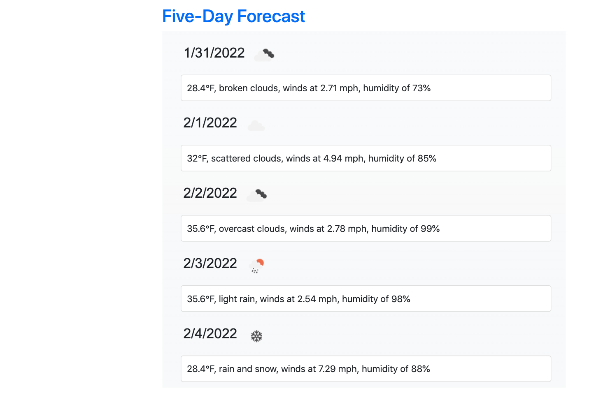

🌸 hey there! 🌸  

welcome to work day scheduler, the simple and easy-to-use app to organize your girlbossing day ahead. this was created as part of the uc berkeley full stack development course curriculum.  

in this challenge, i was tasked with:  

🍓 pulling and displaying weather data from the open weather map api  
🍓 dynamically creating a five-day weather forecast tab  
🍓 creating a method to save and get previously searched cities from local storage  

here are some screenshots of my work:

you can view the deployed project at the <a href="https://descardi-b.github.io/the-weather-app/">link here</a>
